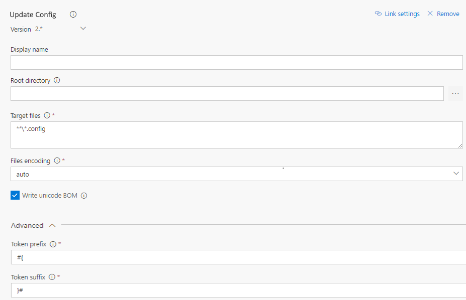

# Update Config task
Visual Studio Team Services Build and Release extension that updates files with variable values. Is it not necessary to have token as placeholder, the replace will look at the variable name and replace its value. Specifically designed for .Net config files.

PS: **This is a fork from vsts-replacetokens-task all credit goes to qetza.**

## Usage
Add a new task, select **Update Config** from the **Utility** category and configure it as needed.

Parameters include:
- **Root directory**: the base directory for searching files. If not specified the default working directory will be used.
- **Target files**: the absolute or relative newline-separated paths to the files. Wildcards can be used (eg: `**\*.config` for all config files in all sub folders).
- **Files encoding**: the files encoding used for reading and writing. The 'auto' value will determine the encoding based on the Byte Order Mark (BOM) if present; otherwise it will use ascii.
- **Write unicode BOM**: if checked writes an unicode Byte Order Mark (BOM).
- **Token prefix**: the prefix of the tokens to search in the target files. This is only used in the case of nested variables.
- **Token suffix**: the suffix of the tokens to search in the target files. This is only used in the case of nested variables.